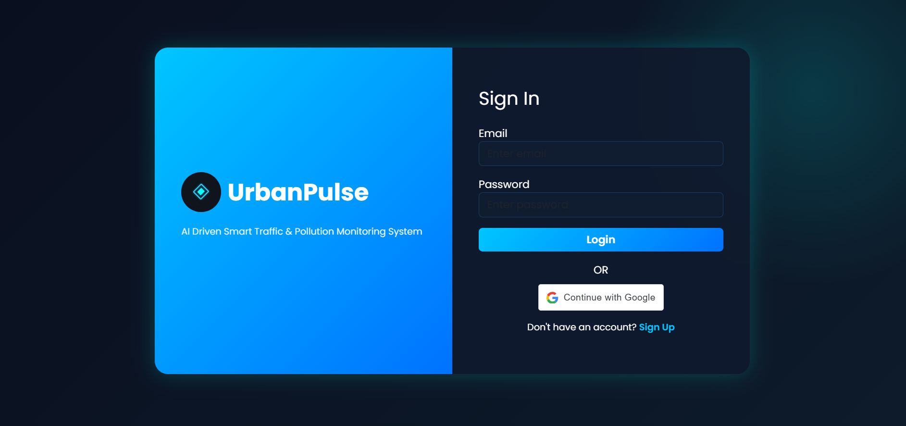
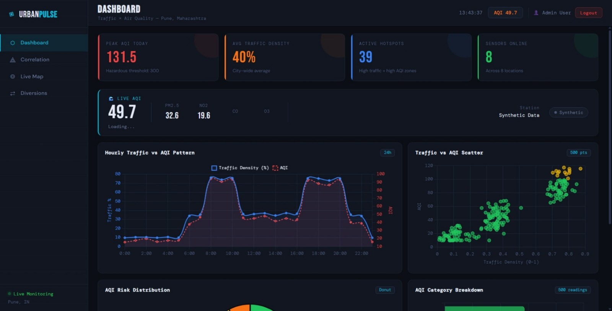
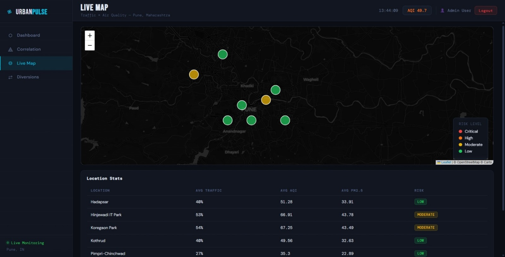

🚦 UrbanPulse – Smart Traffic & Pollution Analysis System

📌 Project Overview

UrbanPulse is an AI-powered smart city analytics platform designed to monitor traffic congestion and air pollution levels in real time.This system combines traffic density data with air quality metrics to analyze correlations between vehicle congestion and pollution levels. The platform provides interactive dashboards, live monitoring maps, and advanced analytics to help city authorities make better traffic and environmental decisions.

The project was developed for Code4Society Hackathon 2026 under the theme AI-Driven Sustainable Mobility.

🛠 Tools & Technologies Used
- Frontend: 
React.js
JavaScript
HTML / CSS

- Backend:
Python
Flask / FastAPI

- Data Processing: 
Python (Pandas, NumPy)

- Visualization: 
Plotly
Chart.js

- Mapping: 
Leaflet.js
OpenStreetMap

- Machine Learning / Analytics: 
Correlation Analysis
Traffic & AQI Prediction Models

📊 System Features

1️⃣ Smart Dashboard
* Real-time analytics for traffic and air pollution.
Features:
- Peak AQI tracking
- Average traffic density monitoring
- Active pollution hotspots
- Live AQI monitoring
- Hourly traffic vs AQI pattern analysis
- Traffic vs AQI scatter visualization
- AQI category distribution

2️⃣ Correlation Analysis
* Advanced analytics to understand relationships between traffic and pollution.
Metrics included:
- Traffic Density vs AQI
- Traffic Density vs PM2.5
- Traffic Density vs NO₂
- Vehicle Count vs AQI
- Statistical models used:
- Pearson Correlation
- Spearman Correlation
- P-value Significance Testing

3️⃣ Live Monitoring Map
* Interactive city map displaying traffic and pollution levels.
Features:
- Real-time location monitoring
- Risk level indicators
- Pollution hotspot detection
- Traffic density visualization
- Smart routing insights

* Risk levels displayed:
🔴 Critical
🟠 High
🟡 Moderate
🟢 Low

📈 Key Analytics Implemented
- Traffic vs AQI correlation modeling
- Real-time pollution hotspot detection
- Hourly traffic pattern analysis
- Pollution risk classification
- Multi-location monitoring
- Statistical significance testing

🚀 Impact & Benefits
- Environmental Impact
- Helps identify high pollution zones
- Supports sustainable traffic planning
- Reduces vehicle emissions
- Operational Benefits
- Real-time traffic monitoring
- Faster decision making
- Reduced congestion
- Strategic Benefits
- Data-driven urban planning
- Smart city infrastructure integration
- Scalable monitoring system

🔮 Future Scope
- UrbanPulse can be expanded with:
- AI-based traffic signal optimization
- Emergency vehicle Green Wave routing
- Predictive traffic congestion alerts
- Citizen mobile application
- Smart eco-routing suggestions
- Integration with Smart City IoT sensors
- Expansion to multiple cities

📸 Project Screenshots
# 📸 Project Screenshots

## 🔐 Login Page

## 📊 Dashboard

## 📈 Correlation Analysis

## 🗺 Live Map

📌 How to Use
1. Clone or download this repository.
2. Install the required dependencies.
3. Run the backend server using Python.
4. Launch the frontend application.
5. Open the dashboard in your browser to explore live traffic and air pollution analytics.

👨‍💻 Author

Your Name: Vedant Kale

GitHub: https://github.com/Vedantkale3

LinkedIn: https://www.linkedin.com/in/vedant-kale-b75419292

⭐ If you found this project useful, feel free to star the repository!
